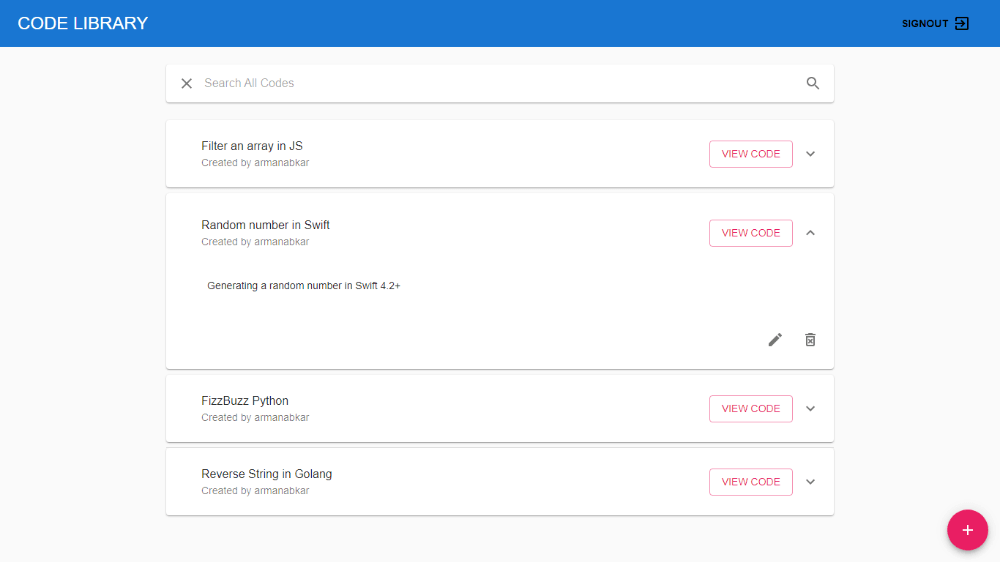

# Code Library

A library for sharing codes. Built with React, Django and GraphQL.

<h2 align="center">
  
   
</h2>

## Installation & Usage

1. Clone the repository
2. Open the project folder in the terminal/command line and enter `pipenv install` and then `pipenv shell` and run the Django server with `python manage.py runserver`.
3. Cd into the client folder and run `npm install` & `npm start`.
